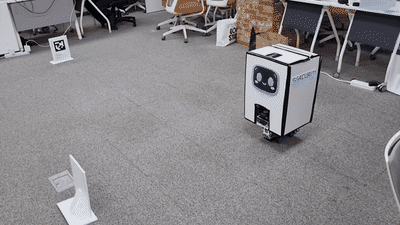
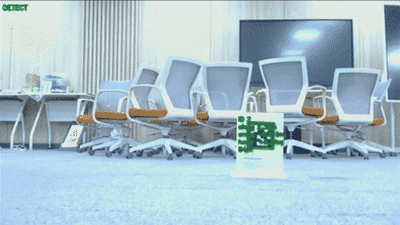
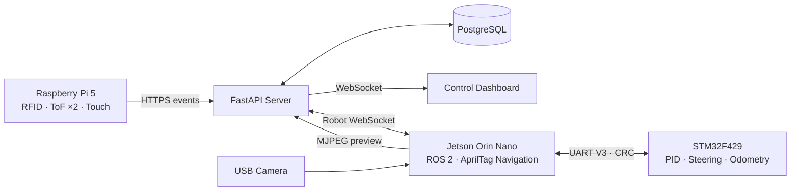

# SSACURITY (싸큐리티)

> **AprilTag 기반 자율주행 로봇으로 셔틀 승강장 출입을 관제하는 통합 보안 시스템**

SSAFY 15기 공통 프로젝트 · Team C207 · 2026.07–2026.08

`ROS 2 Humble` · `AprilTag` · `Jetson Orin Nano` · `STM32F429` · `FastAPI` · `PostgreSQL` · `WebSocket`

📄 **[최종 발표자료 보기](docs/SSACURITY-final-presentation.pdf)**

## 동작 데모

<table width="100%">
  <tr>
    <th width="50%">AprilTag 경로 주행</th>
    <th width="50%">카메라 AprilTag 검출</th>
  </tr>
  <tr>
    <td width="50%" align="center"></td>
    <td width="50%" align="center"></td>
  </tr>
</table>

## 프로젝트 소개

셔틀 승강장에서는 운행 시간마다 보안 요원이 태깅 장비를 직접 설치하고 회수해야 했습니다.
SSACURITY는 이 반복 업무를 로봇이 대신하고, 태깅 여부와 무단 통과·로봇 상태·카메라 영상을
한 화면에서 확인할 수 있도록 만든 팀 프로젝트입니다.

1. 셔틀 도착 신호를 받으면 관제 서버가 로봇에 출동 명령을 보냅니다.
2. 로봇은 AprilTag를 기준으로 승강장까지 주행합니다.
3. RFID 태깅과 두 개의 ToF 센서로 통과 방향과 미태깅 여부를 판정합니다.
4. 운행이 끝나면 로봇은 충전 위치로 복귀합니다.

## 핵심 성과

| 항목 | 결과 |
| --- | --- |
| AprilTag 경로 주행 | 태그 4장을 이용한 출발·90° 회전·도착·U턴·복귀 상태머신 구현 |
| Jetson 핵심 로직 검증 | ROS 비의존 CRC·파서·오도메트리·AprilTag 기하·경로 테스트 **243 passed** |
| 폐루프 E2E 검증 | 출발/복귀, abort, FAULT latch, reset 시나리오 **5/5 통과** |
| 안전 정지 | 상태머신이 200ms 동안 명령을 갱신하지 못하면 UART 송신기가 neutral 명령 강제 |
| 관제 연동 | FastAPI·PostgreSQL·WebSocket 기반 실시간 로봇/출입 이벤트 중계 |

## 시스템 아키텍처



### 역할 분리

- Jetson은 카메라 기반 위치 추정, 경로 상태머신, 목표 속도·조향값 생성을 담당합니다.
- STM32는 속도 PID, 조향 서보, 엔코더·오도메트리와 하위 안전 제어를 담당합니다.
- Raspberry Pi는 RFID·ToF 이벤트와 안내 장치를 담당합니다.
- FastAPI 서버는 로봇 명령, 출입 판정, 경고, 통계와 대시보드를 연결합니다.

## 담당 영역 — 현은빈

Jetson Orin Nano에서 동작하는 AprilTag 자율주행 영역을 담당했습니다.

### 1. AprilTag 위치 추정

- OpenCV 기반 `tag36h11` 검출과 카메라 좌표계 변환
- 태그까지의 종방향 거리와 횡방향 오차 계산
- 회전 구간에서는 카메라 대신 STM32 yaw 누적값으로 회전각 판정
- 관련 코드: [`robot_perception`](hardware/jetson/ros2_ws/src/robot_perception/)

### 2. 왕복 경로 상태머신

| 출발 경로 | 복귀 경로 |
| --- | --- |
| 태그 2 접근 → 직진 → 우회전 90° → 태그 3 도착 | U턴 180° → 태그 4 직진 → 좌회전 90° → 태그 1 도킹 |

- 원거리 200mm/s에서 접근 구간 150mm/s까지 선형 감속
- 태그를 잠시 놓쳐도 진입 yaw를 유지하되 최대 주행거리와 시간 상한을 계속 감시
- FAULT는 명시적으로 재무장할 때까지 유지하고, 일시 장애물 HOLD는 해제 시 자동 복귀
- 관련 코드: [`robot_navigation`](hardware/jetson/ros2_ws/src/robot_navigation/)

### 3. Jetson–STM32 통신과 검증 환경

- UART V3 프레임, CRC, 스트림 파서와 가상 STM32 구현
- 실제 카메라·차량 없이도 `route_runner → fake_stm32 → course_sim`이 닫힌 고리로 동작하도록 구성
- USB/시리얼 탐색, 카메라 확인, 주행 모니터링과 오도메트리 검증 도구 제공
- 관련 코드: [`stm32_bridge`](hardware/jetson/ros2_ws/src/stm32_bridge/), [`robot_bringup`](hardware/jetson/ros2_ws/src/robot_bringup/)

## 주요 기능

| 기능 | 설명 | 구현 위치 |
| --- | --- | --- |
| 자율 출동·복귀 | AprilTag 고정 경로를 따라 승강장과 충전 위치를 왕복 | `hardware/jetson/` |
| 태깅·통과 판정 | 카드 태깅 크레딧과 ToF 통과 이벤트를 상태머신으로 결합 | `backend/app/credit/` |
| 무단 통과 경고 | 유효 태깅 없이 통과한 이벤트를 기록하고 실시간 알림 | `backend/app/routers/ingest.py` |
| 관제 대시보드 | 로봇 상태, 지도, 이벤트, 경고, 통계, 카메라 확인 | `frontend/index.html` |
| 실시간 통신 | 대시보드/로봇 WebSocket 채널과 로봇 텔레메트리 중계 | `backend/app/`, `hardware/jetson/ros2_ws/src/web_bridge/` |
| 관제 보조 AI | 조회 데이터 기반 일일 요약·경고 브리핑·질의응답 | `ai/control_assistant/` |
| 게이트 장치 | RFID, ToF 2개, 터치 센서와 안내 음성 제어 | `hardware/rpi/` |

## 기술 스택

| 영역 | 기술 |
| --- | --- |
| Robot | ROS 2 Humble, Python, OpenCV, AprilTag, Ackermann steering |
| Edge | Jetson Orin Nano, Raspberry Pi 5, STM32F429I-DISC1 |
| Backend | Python 3.12, FastAPI, SQLAlchemy, Alembic, PostgreSQL 16 |
| Realtime | WebSocket, UART 115200 8N1, MJPEG |
| AI | llama.cpp OpenAI-compatible API, Qwen 계열 모델, YOLO person guard prototype |
| Test | pytest, fake STM32, closed-loop course simulator |

## 저장소 구조

```text
.
├─ ai/                         # 관제 보조 AI, 평가, 사람 감지 프로토타입
├─ backend/                    # FastAPI 서버, DB 모델·마이그레이션, 테스트
├─ frontend/                   # 빌드 없는 단일 페이지 관제 대시보드
├─ hardware/
│  ├─ jetson/ros2_ws/         # AprilTag 인식, 경로 주행, UART/WebSocket 브리지
│  ├─ rpi/                    # RFID·ToF 게이트 장치
│  └─ stm32-drive/            # STM32 모터·조향·센서 펌웨어
```

## 빠른 시작

### 백엔드

PostgreSQL을 준비한 뒤 예시 환경 변수를 복사하고 필요한 값을 채웁니다.

```bash
cd backend
python -m venv .venv
source .venv/bin/activate          # Windows: .venv\Scripts\activate
pip install -r requirements-dev.txt
cp .env.example .env
alembic upgrade head
uvicorn app.main:app --host 127.0.0.1 --port 8000 --workers 1
```

기동 확인:

```bash
curl http://127.0.0.1:8000/healthz
```

Docker 이미지는 저장소 루트를 빌드 컨텍스트로 사용합니다.

```bash
docker build -f backend/Dockerfile -t ssacurity-backend:latest .
```

### Jetson ROS 2 워크스페이스

Ubuntu 22.04와 ROS 2 Humble 환경을 기준으로 합니다.

```bash
cd hardware/jetson/ros2_ws
source /opt/ros/humble/setup.bash
colcon build --symlink-install
source install/setup.bash
ros2 launch robot_bringup tag_drive.launch.py use_fake:=true
```

자세한 주행 상태, 파라미터와 실측값은
[`hardware/jetson/ros2_ws/README.md`](hardware/jetson/ros2_ws/README.md)를 참고하세요.

## 테스트

### 백엔드

테스트 DB 이름이 `_test`로 끝나지 않으면 안전을 위해 실행을 거부합니다.

```bash
cd backend
pytest
```

### Jetson 순수 로직

아래 전체 명령은 ROS 2 Humble 환경을 기준으로 합니다. 이번 공개본 정리 과정에서는 Windows에서
ROS 의존 테스트를 제외하고 핵심 순수 로직 243개가 통과했습니다.

```bash
cd hardware/jetson/ros2_ws
python3 -m pytest \
  src/stm32_bridge/test \
  src/robot_perception/test \
  src/robot_navigation/test -q
```

### 폐루프 E2E

```bash
cd hardware/jetson/ros2_ws
bash src/robot_bringup/test/e2e.sh
```

## 팀

| 이름 | 담당 |
| --- | --- |
| 손세욱 | 백엔드 · AI · 인프라 |
| 한동인 | 프론트엔드 · 발표 |
| 황시은 | RFID · ToF · Raspberry Pi |
| **현은빈** | **Jetson · AprilTag 자율주행 · 관제 연동** |
| 조용주 | 모터 제어 · 배선 · IMU 연동 |
| 조철민 | STM32 주행 제어 |

## 공개 범위

이 저장소에는 소스 코드와 재현에 필요한 예시 설정만 포함합니다. 실제 계정, 비밀번호, API 키,
운영 서버 주소와 데이터베이스 덤프는 공개 대상에서 제외했습니다. 팀 공동 프로젝트이므로 별도
라이선스가 확정되기 전까지 코드 재사용·재배포 권한은 부여하지 않습니다.
